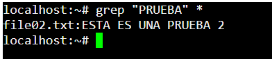
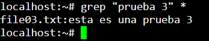
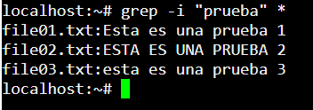
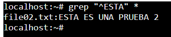
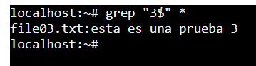

### 1-1/1-2 ¿Qué son las expresiones regulares? / Explica brevemente para que sirven las expresiones regulares
Es una cadena de cáracteres/simbolos, que nos sirve para filtrar palabras/carácteres. Así podemos encontrar por ejemplo, todos los mails de un texto grande e ir más rapido. Se usa también para validar campos en programación.

1-3.
 a)

b)

c)

d)

e)

f)

### 1-4 ¿Qué es un motor de expresiones regulares? ¿Para que sirven?
Cada lenguaje de programación o buscador (como puede ser GREP o vscode), tiene su propia forma para interpretar regex. 99% es igual en todos, pero habrá pequeñas variaciones, como si fuese un dialecto/acento de un idioma, por ejemplo catalán/valenciano

### 1-5 ¿Cuáles son los principales motores de expresiones regulares? ¿Cuál vamos a utilizar nosotr@s?
Utilizaremos Regexp (JS), Java.util.regexp(java).
Principales motores:
- Regexp
- java.util.regexp
- grep
- pcre
- re

### 1-6 ¿Qué es un patrón? ¿Y un match?
El patrón son los caracteres que utilizamos para buscar un match. El match es la coincidencia de este patrón.

### 1-7 Saca el esquema del siguiente patrón ^Hola$ y, además, explica que hace dicha expresión regular sobre el siguiente documento
"Hola
Hola ¿Qué tal?
Hola y adiós"

En este caso la expresión hace match en el "Hola" de la primera línea, ya que empieza y acaba con esa palabra.